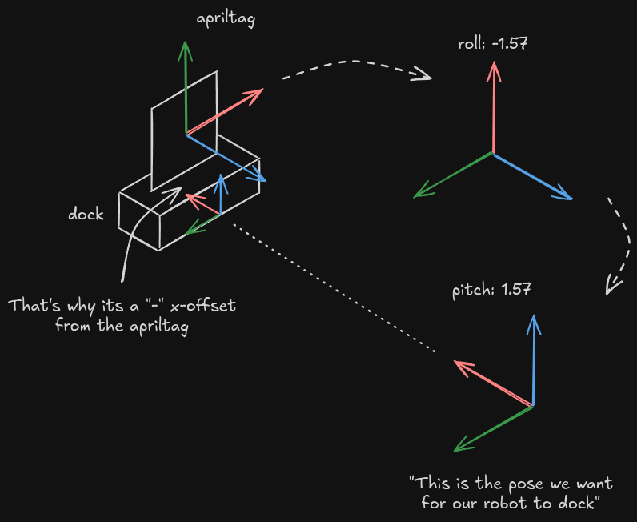

# Nav2 Docking Integration Guide

To use the nav2 docking service, below steps has to be done:

1. Apriltag ROS 2 Detector

    In this example, this [package](https://github.com/christianrauch/apriltag_ros) has been used for apriltag detection. You can simply install it with command `sudo apt install ros-${ROS-DISTRO}-apriltag-ros`. Create a parameter file for node configuration. You can find an example in [here](./config/apriltag_params.yaml).

1. Create a custom node to publish desired topics

    This node helps publishing the detected apriltag result from the `apriltag-ros` node to the nav2 docking service interface, a topic `detected_dock_pose`.

1. Create a launch file to start up above services

    **Tip**: You might use `image_pipeline` ros package to help image pre-processing.

    This launch file will then be included in the bringup launch to maintain a single entry point of the nav2.

1. Configure `docking_server` in the `nav2_params` file

    **Tip**: You might reference this [document](https://docs.nav2.org/configuration/packages/configuring-docking-server.html) for available parameters and its meaning.

    **Extra Tips**: It might be not easy to understand those parameters with respect to `dock_pose` at the first time. First, you have to understand below parameters meaning:

    ```
    external_detection_translation_x: -0.2
    external_detection_translation_y: 0.0
    external_detection_rotation_roll: -1.57
    external_detection_rotation_pitch: 1.57
    external_detection_rotation_yaw: 0.0
    ```

    These transformation are telling the system that how the detected apriltag frame transform back to robot's frame (`base_link` or `odom`). Below image shows how the transformation works (tried my best to draw, hopefully help).

    

    Once you figure out how the dock pose is defined, you can fine tune the stageing pose as well. Staging pose is a pose that the robot would first navigate to before entering docking behaviour. You should give some room between the exact dock pose and the stage pose so that the robot can slightly adjust its pose to better align to the final pose.
